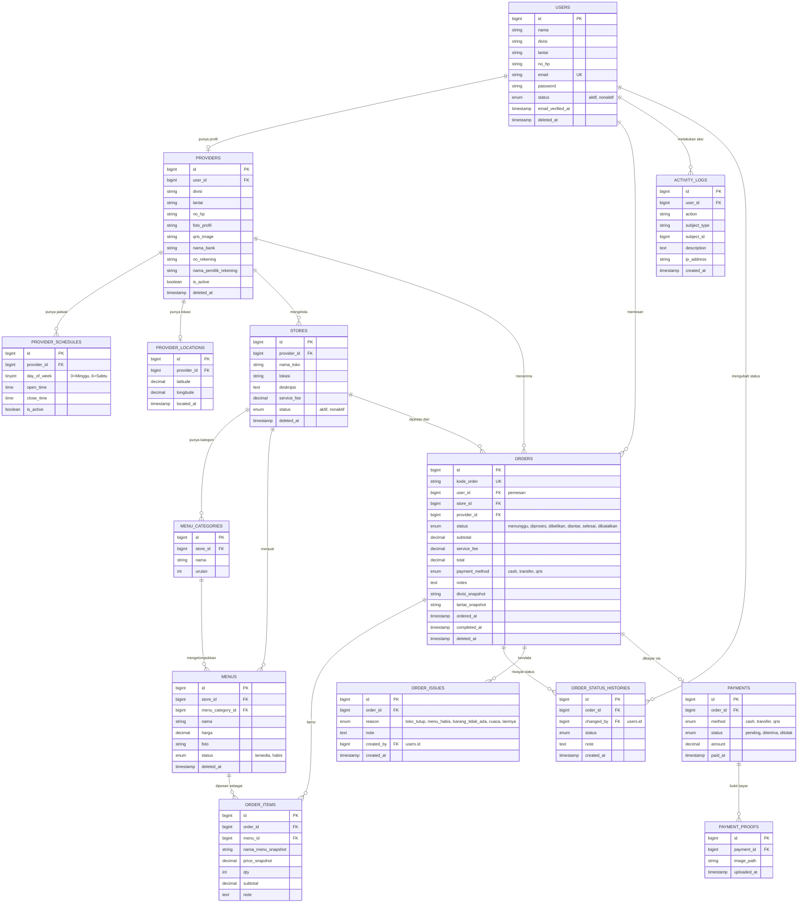

# WawanGo — Entity Relationship Diagram

## Diagram

## Catatan Desain

- **RBAC**: tabel `roles`, `permissions`, `model_has_roles`, `model_has_permissions`, `role_has_permissions` disediakan oleh package `spatie/laravel-permission` (industry-standard, teruji), bukan tabel custom. `User` memakai trait `HasRoles`.
- **Notifications**: memakai tabel bawaan Laravel Notification (`php artisan notifications:table`) — morph table `notifiable_type`/`notifiable_id`, `type`, `data` (JSON), `read_at`.
- **Soft Delete**: diterapkan pada tabel master yang datanya tidak boleh hilang permanen demi integritas histori — `users`, `providers`, `stores`, `menus`, `orders`.
- **Snapshot fields**: `order_items` menyimpan `nama_menu_snapshot` & `price_snapshot`, dan `orders` menyimpan `divisi_snapshot`/`lantai_snapshot` — supaya histori order tetap akurat walau menu/harga/data user berubah di kemudian hari.
- **provider_locations**: schema-only untuk Stage 1. Kolom `latitude`/`longitude`/`located_at` disiapkan agar fitur live GPS tracking (browser geolocation) tinggal diaktifkan di stage mendatang tanpa migrasi ulang.
- **order_status_histories**: dasar data untuk komponen timeline tracking di sisi Pemesan (Menunggu → Diproses → Dibelikan → Diantar → Selesai) dan untuk audit perubahan status oleh Admin/Provider.
- **Foreign keys**: seluruh relasi memakai `foreignId()->constrained()` dengan `onDelete('cascade')` untuk data anak (order_items, payment_proofs, dst) dan `onDelete('restrict')`/`cascade` sesuai konteks agar data histori order tidak hilang saat data referensi dihapus.
