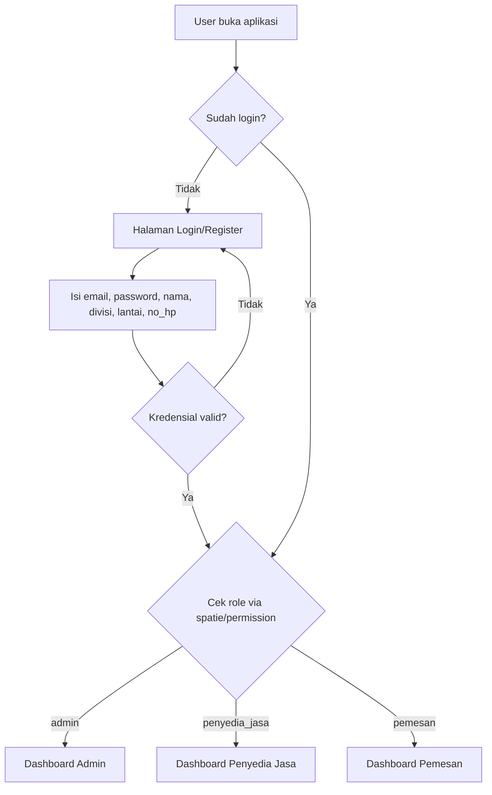
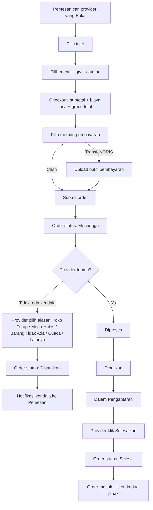
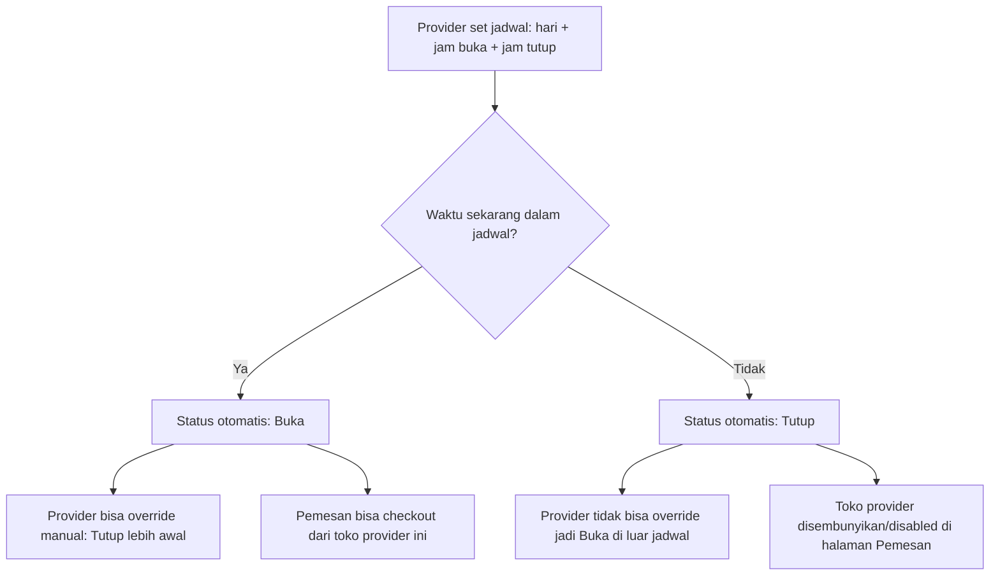
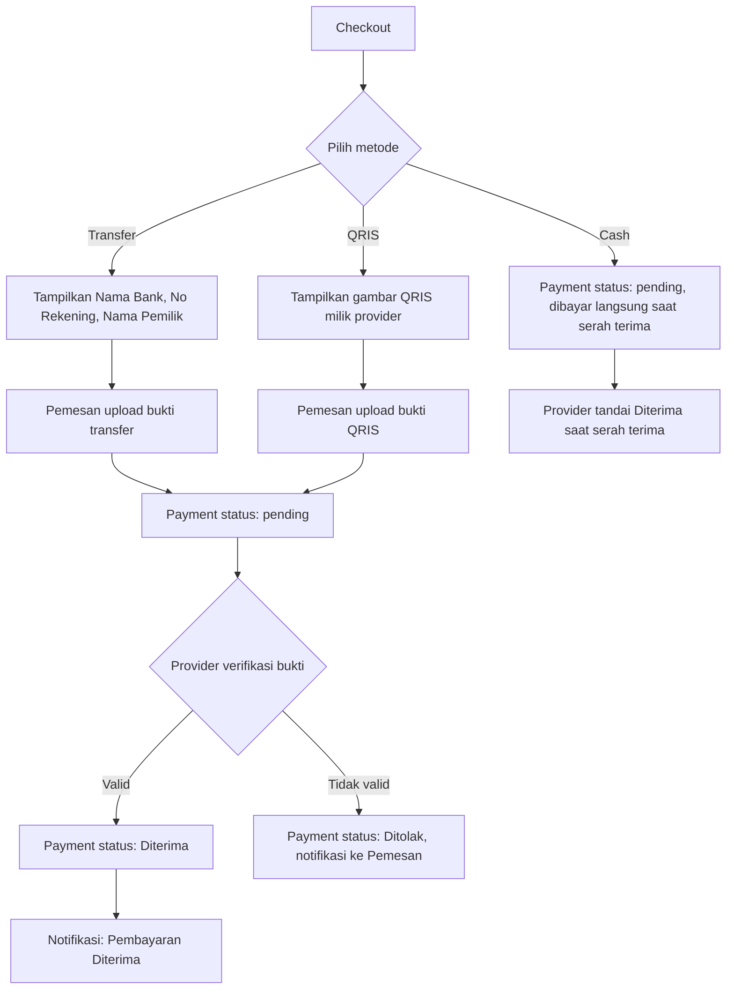
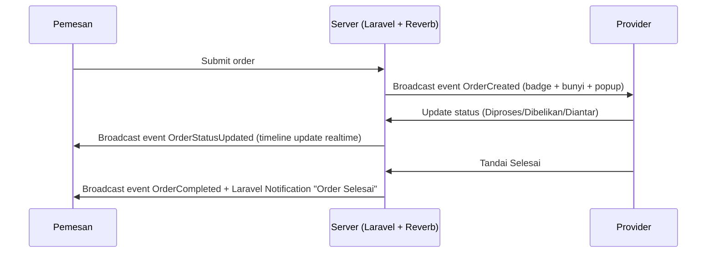

# WawanGo — Flow Aplikasi

## 1. Flow Autentikasi & Redirect per Role

## 2. Flow Order Lifecycle (Pemesan ↔ Penyedia Jasa)

Setiap perubahan status di atas dicatat ke `order_status_histories` dan dipancarkan sebagai event realtime (Reverb) sehingga Pemesan melihat timeline tracking tanpa reload — detail integrasi realtime dikerjakan di stage Realtime Notification.

## 3. Flow Status Layanan Provider (Buka/Tutup)

## 4. Flow Pembayaran

## 5. Flow Notifikasi Realtime (ringkasan, detail di stage Realtime)

